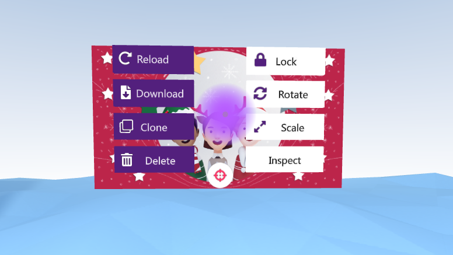

Objects can be manipulated by for example scaling, rotating or moving them.

The object controls can be found by holding SPACE while holding the cursor over an object:

### Moving {#moving}
Click-and-hold the mouse button while hovering over an object and drag with your mouse to move it.

### Scaling {#scaling}

Hold down SPACE while hovering your cursor over the object to open the object menu. Click and hold "Scale" and move your mouse to resize.

### Rotating {#rotating}

Hold down SPACE while hovering your cursor over the object to open the object menu. Click and hold "Rotate" and move your mouse to resize.

:::note

Hold SHIFT while rotating to rotate precisely.

:::

### Locking {#locking}

Hold down SPACE and click "Lock"/"Unlock" in the object menu.

Locking will do two very important things:
- Prevents moving the object accidentally.
- Makes the object persist in the room even after leaving.

