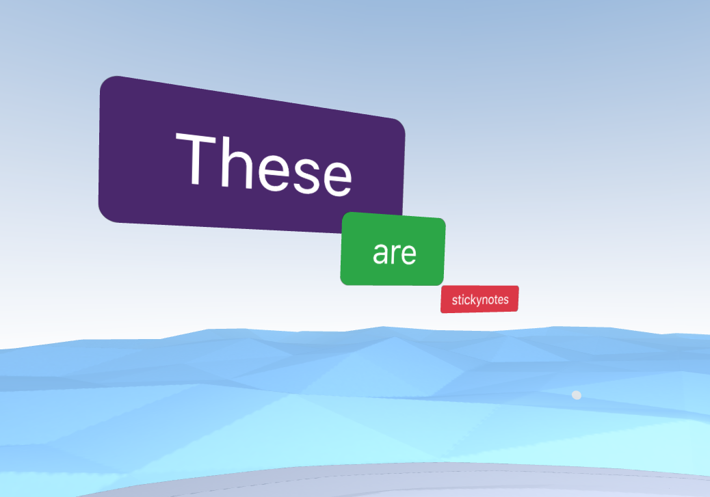

Stickynotes are images generated from text. They can be useful for workshops, brainstorming, annotations, etc.

---

## Creating stickynotes {#creating-stickynotes}
If the room you are in allows sticky notes, you will see the following icon:

Click on the icon, select a color, write the desired text and click "Create Stickynote".

Stickynote text support all character sets

The note should appear in front of your avatar like so:

---

## Manipulating stickynotes {#manipulating-stickynotes}

Once a stickynote is created, it is considered an image that can be modified like other objects in the 3D environment. Please see the [controls documentation](controls.md) on how to manipulate objects.

